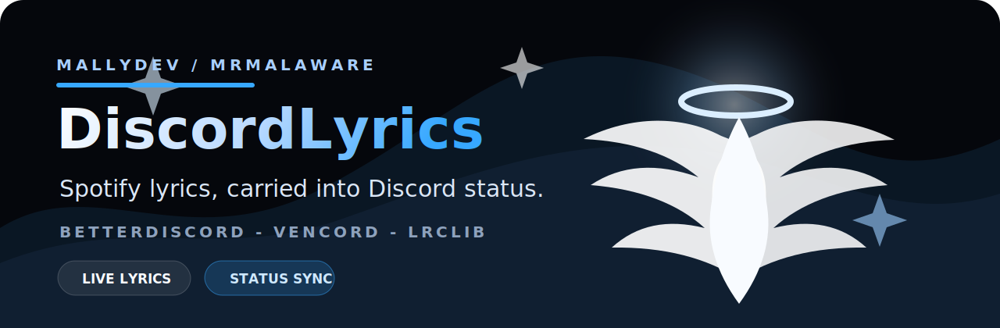

<p align="center">
  
</p>

<h1 align="center">DiscordLyrics</h1>

<p align="center">
  <strong>A dark celestial Spotify lyrics status plugin for Discord by MallyDev and MrMalaware.</strong>
</p>

<p align="center">
  <a href="https://github.com/MallyDev2/DiscordLyrics/releases/latest/download/SpotifyLyricsStatus.plugin.js"></a>
  <a href="https://github.com/MallyDev2/DiscordLyrics/releases/latest/download/vencord-spotifyLyricsStatus.zip"></a>
  
</p>

DiscordLyrics turns Spotify playback into a live custom status. It carries the current lyric line into Discord with a polished MallyDev / MrMalaware style: clean, dark, bright, and a little angelic.

## What It Does

- Shows synced Spotify lyrics as your Discord custom status.
- Falls back to the current track when synced lyrics are unavailable.
- Keeps the last song visible when playback pauses.
- Uses LRCLIB for lyric lookup.
- Includes ready-to-use builds for BetterDiscord and Vencord.

## Downloads

| Client | Download | Install |
| --- | --- | --- |
| BetterDiscord | [SpotifyLyricsStatus.plugin.js](https://github.com/MallyDev2/DiscordLyrics/releases/latest/download/SpotifyLyricsStatus.plugin.js) | Drop the file into your BetterDiscord plugins folder. |
| Vencord | [vencord-spotifyLyricsStatus.zip](https://github.com/MallyDev2/DiscordLyrics/releases/latest/download/vencord-spotifyLyricsStatus.zip) | Extract `spotifyLyricsStatus` into `Vencord/src/userplugins/`, then rebuild Vencord. |

## BetterDiscord

1. Download `SpotifyLyricsStatus.plugin.js`.
2. Move it into your BetterDiscord plugins folder.
3. Reload Discord with `Ctrl+R`.
4. Enable `SpotifyLyricsStatus`.
5. Make sure Spotify is connected to Discord and visible as your activity.

## Vencord

1. Download `vencord-spotifyLyricsStatus.zip`.
2. Extract the `spotifyLyricsStatus` folder.
3. Copy it into:

   ```text
   Vencord/src/userplugins/spotifyLyricsStatus
   ```

4. Rebuild Vencord from the Vencord source folder:

   ```bash
   pnpm build
   ```

5. Reinstall or inject your custom Vencord build, restart Discord, then enable `SpotifyLyricsStatus`.

## Behavior

DiscordLyrics watches your Spotify activity, matches the track through LRCLIB, and updates your custom status only when the line changes. Long lyric lines are trimmed to fit Discord's custom status limits.

If synced lyrics are not found, the plugin uses:

```text
Song - Artist
```

## Notes

- Spotify must be connected to Discord for track detection.
- Some songs do not have synced lyrics available.
- Keep Discord, Spotify, BetterDiscord, and Vencord updated for best results.
