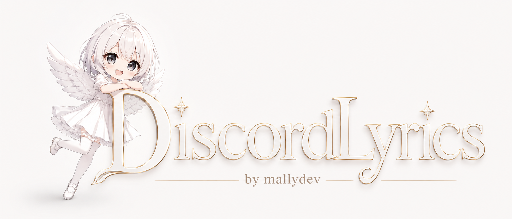

<p align="center">
  
</p>

<h1 align="center">DiscordLyrics</h1>

<p align="center">
  <strong>A polished Spotify lyric status plugin for Discord, built by MallyDev2.</strong>
</p>

<p align="center">
  <a href="https://github.com/MallyDev2/DiscordLyrics/releases/latest"></a>
  <a href="https://github.com/MallyDev2/DiscordLyrics/actions"></a>
  <a href="https://github.com/MallyDev2/DiscordLyrics/releases/latest/download/SpotifyLyricsStatus.plugin.js"></a>
  <a href="https://github.com/MallyDev2/DiscordLyrics/releases/latest/download/vencord-spotifyLyricsStatus.zip"></a>
  
</p>

DiscordLyrics syncs Spotify playback into your Discord custom status. When synced lyrics are available, your status follows the current lyric line. When lyrics are unavailable, it falls back to the current song so your profile still looks clean instead of empty.

## Highlights

- Live lyric status from Spotify playback.
- BetterDiscord plugin build.
- Vencord userplugin build.
- LRCLIB synced lyric lookup.
- Pause fallback using the last detected track.
- Rate-conscious status updates.
- Rebuildable release package with npm scripts.

## Download

| Client | Release file | Setup |
| --- | --- | --- |
| BetterDiscord | [SpotifyLyricsStatus.plugin.js](https://github.com/MallyDev2/DiscordLyrics/releases/latest/download/SpotifyLyricsStatus.plugin.js) | Place the file in your BetterDiscord plugins folder. |
| Vencord | [vencord-spotifyLyricsStatus.zip](https://github.com/MallyDev2/DiscordLyrics/releases/latest/download/vencord-spotifyLyricsStatus.zip) | Extract `spotifyLyricsStatus` into `Vencord/src/userplugins/`, then rebuild Vencord. |

## BetterDiscord Setup

1. Download `SpotifyLyricsStatus.plugin.js`.
2. Move it into your BetterDiscord plugins folder.
3. Reload Discord with `Ctrl+R`.
4. Enable `SpotifyLyricsStatus`.
5. Make sure Spotify is connected to Discord and visible as your activity.

Common plugin folders:

```text
Windows: %AppData%\BetterDiscord\plugins
macOS: ~/Library/Application Support/BetterDiscord/plugins
Linux: ~/.config/BetterDiscord/plugins
```

## Vencord Setup

1. Download `vencord-spotifyLyricsStatus.zip`.
2. Extract the `spotifyLyricsStatus` folder.
3. Copy it into your Vencord source tree:

   ```text
   Vencord/src/userplugins/spotifyLyricsStatus
   ```

4. Rebuild Vencord:

   ```bash
   pnpm build
   ```

5. Reinstall or inject your custom Vencord build, restart Discord, then enable `SpotifyLyricsStatus`.

## How It Works

DiscordLyrics reads your Spotify activity from Discord, matches the current track through LRCLIB, and updates your custom status when the active lyric line changes.

Fallback format:

```text
Song - Artist
```

## Project Package

This repo includes a lightweight package workflow so releases can be rebuilt from source.

```bash
npm install
npm run check
npm run build
```

| Script | Purpose |
| --- | --- |
| `npm run check` | Validates the BetterDiscord plugin syntax. |
| `npm run build` | Rebuilds the BetterDiscord and Vencord release files in `dist/`. |
| `npm run release:pack` | Runs validation, then rebuilds release artifacts. |

## Repository Layout

```text
DiscordLyrics/
  SpotifyLyricsStatus.plugin.js
  vencord-userplugin/spotifyLyricsStatus/
  scripts/build-release.js
  dist/
  assets/
```

## Troubleshooting

| Issue | Fix |
| --- | --- |
| Lyrics do not show | Make sure Spotify is connected to Discord and visible as activity. |
| Song shows but lyric does not | The song may not have synced lyrics in LRCLIB yet. |
| Vencord plugin missing | Confirm the folder path is `Vencord/src/userplugins/spotifyLyricsStatus`. |
| Status updates slowly | Discord can rate-limit custom status changes, so the plugin avoids unnecessary updates. |

## Compatibility

| Platform | Status |
| --- | --- |
| BetterDiscord | Supported |
| Vencord userplugin | Supported |
| Spotify activity | Required |
| LRCLIB synced lyrics | Used when available |

## License

Released under the [MIT License](LICENSE).
